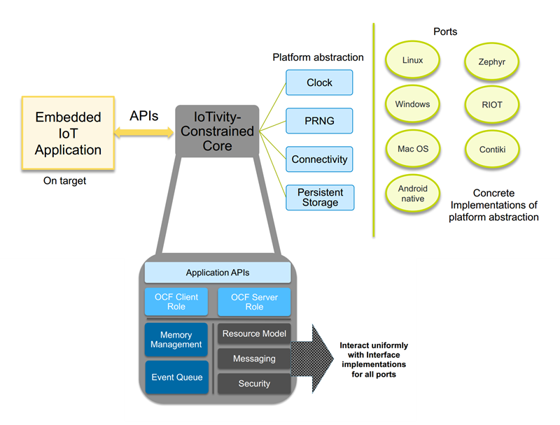

Getting Started
---------------

IoTivity-Lite is a lightweight implementation of the
`Open Connectivity Foundation <https://openconnectivity.org/>`_ (OCF) standards
for the Internet of Things (IoT).

It was designed to build secure and interoperable IoT applications in full
compliance with the
`OCF specifications <https://openconnectivity.org/developer/specifications>`_
with a limited footprint not exceeding the needs of the specifications. The
stack architecture lends itself to be ported rapidly to any chosen hardware/OS
environment.

IoT applications may be built for a wide variety of rich and resource-constrained
devices across the IoT landscape. As a general guideline, it should be feasible
to deploy applications on class 2 constrained devices (>256KB Flash, >64KB RAM),
or better.

The project is open-source, and its code is distributed under the
commercial-friendly Apache v2 license.

Contents
--------

- `IoTivity-Lite Architecture`_
- `Project directory structure`_
- `Setup source tree`_
- `Building sample applications on Linux`_
- `Framework configuration`_

IoTivity-Lite Architecture
---------------------------------

IoTivity-Lite's design presents the following features:

- **OS agnostic core**: This cross-platform core (written in pure C)
  encompasses the APIs, OCF resource model, protocol, security features,
  memory management and event loop. The core interacts
  with lower level platform-specific functionality via a very limited
  collection of abstract interfaces. Such a decoupling of the common
  OCF standards related functionality from adaptations to any OS/target
  facilitates greater ease of long-term maintenance and evolution of
  the stack through successive releases of the OCF specifications.

- **Platform abstraction**: These are a collection of abstract interfaces
  with a small set of hooks to platform-specific features. These interfaces
  are defined in generic terms and elicit a specific contract from
  implementations. The core calls into these interfaces to interact with
  the underlying OS/platform. The simplicity and boundedness of these
  interface definitions allow them to be rapidly implemented on any chosen
  OS/target. Such an implementation then constitutes a "port". A number of ports
  (adaptations) currently exist for immediate use, and the project will
  continue to expand this set.

- **Support for static OR dynamic allocation of internal structures**:
  On environments with a C library that supports heap allocation functions,
  the stack can be configured at build-time to use dynamic memory allocation
  to operate without any pre-configured set of memory constraints.

  Alternatively, the stack may be configured to statically allocate all
  internal structures by setting a number of build-time parameters that
  constrain the number of serviceable connections and requests,
  payload sizes, memory pool sizes, timeouts etc.  These
  collectively characterize an acceptable workload for an application.

- **Lightweight design and low complexity**: This is achieved through
  the implementation of functionally cohesive modules, and weak coupling
  between stack layers.

- **Simple C APIs**: The APIs are defined so as to closely align to OCF
  specification constructs aiding greater ease of understanding. Application
  code utilizing these APIs are largely cross-platform as a consequence
  of the design, and can be quickly migrated over to a any other target
  environment.

Project directory structure
---------------------------

api/*
  contains the implementations of client/server APIs, the resource model,
  utility and helper functions to encode/decode
  to/from OCF’s data model, module for encoding and interpreting type 4
  UUIDs, base64 strings, OCF endpoints, and handlers for the discovery, platform
  and device resources.

messaging/coap/*
  contains a tailored CoAP implementation.

security/*
  contains resource handlers that implement the OCF security model.

utils/*
  contains a few primitive building blocks used internally by the core
  framework.

onboarding_tool/*
  contains the sample onboarding tool (OBT).

deps/*
  contains external project dependencies.

deps/tinycbor/*
  contains the tinyCBOR sources.

deps/mbedtls/*
  contains the mbedTLS sources.

patches/*
  contains patches for deps/mbedTLS and need to be applied once.

include/*
  contains all common headers.

include/oc_api.h
  contains client/server APIs.

include/oc_rep.h
  contains helper functions to encode/decode to/from OCF’s
  data model.

include/oc_helpers.h
  contains utility functions for allocating strings and
  arrays either dynamically from the heap or from pre-allocated
  memory pools.

include/oc_obt.h
  contains the collection of APIs for security onboarding
  and provisioning.

port/\*.h
  collectively represents the platform abstraction.

port/<OS>/*
  contains adaptations for each OS.

apps/*
  contains sample OCF applications.

service/*
  contains OCF services

Setup source tree
-----------------

Grab source and dependencies using:

``git clone --recursive https://github.com/iotivity/iotivity-lite.git``

Building sample applications on Linux
-------------------------------------

The entire build is specified in ``port/linux/Makefile``. The output of the
build consists of all static and dynamic libraries, and sample application
binaries which are stored under ``port/linux``.

Run ``make`` for a release mode build without debug output.

Add ``SECURE=0`` to exclude the OCF security layer and mbedTLS. The security
layer is built by default.

Add ``DEBUG=1`` for a debug mode build with verbose debug output.

Add ``TCP=1`` to include support for TCP endpoints and CoAP over TCP (RFC 8323).

Add ``IPV4=1`` to include IPv4 support in the build. Excluding ``IPV4=1``
produces an IPv6-only build.

Add ``CLOUD=1`` to include OCF Cloud in the build. TCP and IPv4
are included too.

Building sample applications on Windows
---------------------------------------

A Visual Studio project file can be found in
``port/windows/vs2015/IoTivity-Lite.sln``. Open the solution file in
Visual Studio 2015 or newer. If the version of Visual Studio is newer a prompt
should pop up asking if you would like to upgrade the visual studio project
files. Agree to upgrade the files.

Select the version of the samples you would like to build. Debug/Release,
x86/x64. From the ``build`` menu select ``Build Solution``.

The samples can be run from Visual Studio by right clicking on the
``SimpleServer`` or ``SimpleClient`` project from the Solution Explorer and
select ``Debug`` > ``Start new instance``. Or the binaries can be run from the
output folder ``port/windows/vs2015/{Debug|Release}/{Win32|x64}/``.

The build options are hard coded into the visual studio project. The project
defaults to using: dynamic memory allocation, OCF security layer is enabled and
built, and IPv4 support is included in the build.

To change the build options the properties page for each project must be modified
Right click on the project select ``Properties`` find 
``C/C++`` > ``Preprocessor`` > ``Preprocessor Definitions`` find the macro
associated with the feature you wish to enable or disable. For example to
disable the OCF security layer find and delete ``OC_SECURITY`` from the 
``Preprocessor Definitions``. The ``Preprocessor Definitions`` must match for
all projects for them to build and run. Due to the difficulty keeping all the
projects matching it is recommended to avoid modifying the
``Preprocessor Definitions`` unless necessary.

Note: The Linux, Windows, and native Android ports are the only adaptation layers
that are actively maintained as of this writing.

Framework configuration
-----------------------

Build-time configuration options for an application are set in ``oc_config.h``.
This needs to be present in one of the include paths.

Pre-populated (sample) configurations for the sample applications for all
targets are present in ``port/<OS>/oc_config.h``.
