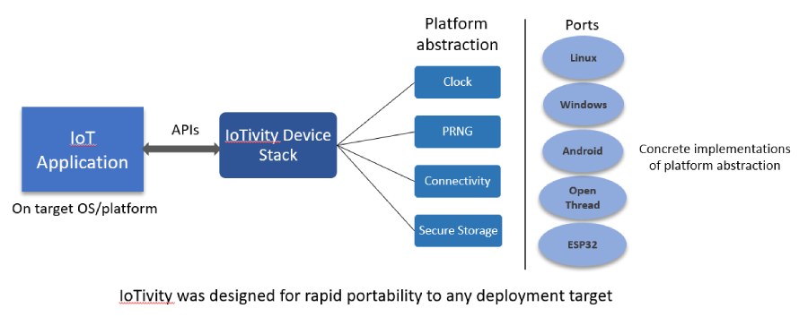

Introduction
------------

IoTivity-Lite is an open-source, reference implementation of the `Open Connectivity Foundation <https://openconnectivity.org/>`_ (OCF) standards for the Internet of Things (IoT). Specifically, the stack realizes all the functionalities of the `OCF Core Framework <https://iotivity.org/documentation/ocf-core-framework>`_.

The challenge for the IoT ecosystem is to ensure that devices can connect securely and reliably to the Internet and to each other. The Open Connectivity Foundation (OCF), a group of industry leaders have created a standard specification and certification program to address these challenges.

.. image:: Architecture.png
   :scale: 100%
   :alt: Architecture
   :align: center

The OCF Core Framework provides a versatile communications layer with best-in-class security for Device-to-Device (D2D) and Device-to-Cloud (D2C) connectivity over IP. IoT interoperability is achieved through the use of consensus-derived, industry standard `data models <https://openconnectivity.org/developer/oneiota-data-model-tool>`_ spanning an array of usage verticals. The OCF Core Framework may be harnessed alongside other IoT technologies in a synergistic fashion to lend a comprehensive and robust IoT solution.

Please review the following resources for more details:

- `OCF Security <https://openconnectivity.org/specs/OCF_Security_Specification_v2.1.2.pdf>`_
- `Device Commissioning (On-boarding and Provisioning) <https://openconnectivity.org/specs/OCF_Onboarding_Tool_Specification_v2.1.2.pdf>`_
- `Cloud Connectivity <https://openconnectivity.org/specs/OCF_Device_To_Cloud_Services_Specification_v2.1.2.pdf>`_
- `Bridging <https://openconnectivity.org/specs/OCF_Bridging_Specification_v2.1.2.pdf>`_
- `Headless Configuration (Wi-Fi Easy Setup) <https://openconnectivity.org/specs/OCF_Wi-Fi_Easy_Setup_Specification_v2.1.2.pdf>`_

The IoTivity project was created to bring together the open-source community to accelerate the development of the framework and services required to connect the growing number of IoT devices. The IoTivity project offers device vendors and application developers royalty-free access to `OCF technologies <https://openconnectivity.org/developer/specifications/>`_ under the `Apache 2.0 license <https://iotivity.org/about/apache-license>`_.

IoTivity stack features
-----------------------

- **OS agnostic:** The IoTivity device stack and modules work cross-platform (pure C code) and execute in an event-driven style. The stack interacts with lower level OS/hardware platform-specific functionality through a set of abstract interfaces. This decoupling of the common OCF standards related functionality from platform adaptation code promotes ease of long-term maintenance and evolution of the stack through successive releases of the OCF specifications.

- **Porting layer:** The platform abstraction is a set of generically defined interfaces which elicit a specific contract from implementations. The stack utilizes these interfaces to interact with the underlying OS/platform. The simplicity and boundedness of these interface definitions allow them to be rapidly implemented on any chosen OS/target. Such an implementation constitutes a "port".
- **Optional support for static memory:** On minimal environments lacking heap allocation functions, the stack may be configured to statically allocate all internal structures by setting a number of build-time parameters, which by consequence constrain the allowable workload for an application.
- **C and Java APIs:** The API structure and naming closely aligns with OCF specification constructs, aiding ease of understanding.

Project directory structure
---------------------------

api/*
  contains the implementations of client/server APIs, the resource model,
  utility and helper functions to encode/decode
  to/from OCF’s data model, module for encoding and interpreting type 4
  UUIDs, base64 strings, OCF endpoints, and handlers for the discovery, platform
  and device resources.

messaging/coap/*
  contains a tailored CoAP implementation.

security/*
  contains resource handlers that implement the OCF security model.

utils/*
  contains a few primitive building blocks used internally by the core
  framework.

onboarding_tool/*
  contains the sample onboarding tool (OBT).

deps/*
  contains external project dependencies.

deps/tinycbor/*
  contains the tinyCBOR sources.

deps/mbedtls/*
  contains the mbedTLS sources.

patches/*
  contains patches for deps/mbedTLS and need to be applied once.

include/*
  contains all common headers.

include/oc_api.h
  contains client/server APIs.

include/oc_rep.h
  contains helper functions to encode/decode to/from OCF’s
  data model.

include/oc_helpers.h
  contains utility functions for allocating strings and
  arrays either dynamically from the heap or from pre-allocated
  memory pools.

include/oc_obt.h
  contains the collection of APIs for security onboarding
  and provisioning.

port/\*.h
  collectively represents the platform abstraction.

port/<OS>/*
  contains adaptations for each OS.

apps/*
  contains sample OCF applications.

swig/*
  contains instructions and code to build Java language bindings using
  the SWIG tool.

Build instructions
------------------

Grab source and dependencies using:

``git clone --recursive https://github.com/iotivity/iotivity-lite.git``

Please check here for build instructions:

- `Linux <https://iotivity.org/documentation/building-iotivity-linux>`_

- `Windows <https://iotivity.org/documentation/building-iotivity-windows>`_

- `Android <https://iotivity.org/documentation/building-iotivity-android>`_

- `Java language bindings <https://iotivity.org/java-language-bindings>`_

Onboarding and Provisioning
----------------------------
Runing the onboarding tool
~~~~~~~~~~~~~~~~~~~~~~~~~~~
At this time there are three versions of the onboarding tool.  The command line C version, the
command line Java version, and the GUI Android version. Both command line versions are identical.
It does not matter which version of the onboarding tool is used.

The C version of the onboarding tool can be found in ``<iotivity-lite>/port/linux`` see Linux build
instructions.

A Java version of the onboarding-tool can be found in
``<iotivity-lite>/swig/apps/java_onboarding_tool``

The following instructions assume the onboarding tool has been built and can run.

Simple Step-by-Step guide for onboarding and provisioning
~~~~~~~~~~~~~~~~~~~~~~~~~~~~~~~~~~~~~~~~~~~~~~~~~~~~~~~~~~
This guide assumes you are starting one discoverable device at a time. Multiple devices can be
discovered and onboarded at the same time however it becomes the responsibility of the user to
figure out which UUID belongs to which device.

Once you have successfully onboarded the samples the first time using the following step-by-step
options feel free to RESET the devices and play around with different provisioning options.

The below steps use the command line version of the onboarding tool. The steps for the Android
onboarding tool is very similar but are not described here.

(Step 1) Onboard and Provision the Server
~~~~~~~~~~~~~~~~~~~~~~~~~~~~~~~~~~~~~~~~~~

There are multiple methods to onboard and provision server and client samples.  Below is given one
of the many possible ways the this could be done.

 - start the server sample
 - start onboarding tool it will print a menu with many option
 - Type ``1`` **Enter** to ``Discover un-owned devices``
 - Type ``8`` **Enter** to *Take ownership of device*

   + Type ``0`` **Enter**. If you have multiple unowned devices you will have to select the correct
     device from the list.

 - Type ``4`` **Enter** to ``Discover owned devices`` the device you just took ownership of should be
   listed.
 - Type ``13`` **Enter** to ``Provision ACE2``. There are many ways to properly provision the device.
   This will give instruction for using wildcard provisioning.

   + Type ``0`` **Enter**. If you have multiple unowned devices you will have to select the correct
     device from the list.
   + Type ``1`` **Enter** for an ``auth-crypt`` ACE
   + Type ``1`` **Enter** in response to ``Enter number of resources in this ACE:``
   + Type ``0`` **Enter** in response to ``Have resource href? [0-No, 1-Yes]:``
   + Type ``1`` **Enter** in response to ``Set wildcard resource? [0-No, 1-Yes]:``
   + Type ``2`` **Enter** to select the ``All discoverable resources`` option
   + Type ``0`` **Enter** in response to ``Enter number of resource types [0-None]:``
   + Type ``0`` **Enter** in response to ``Enter number of interfaces [0-None]``
   + Type ``0`` **Enter** for CREATE, ``1`` **Enter** for RETRIEVE, ``1`` **Enter** for UPDATE,
     ``0`` **Enter** for DELETE, and ``1`` **Enter** for NOTIFY.
   + ``Successfully issued request to provision ACE`` should be printed on the screen upon success

(Step 2) Onboard the client
~~~~~~~~~~~~~~~~~~~~~~~~~~~~
 - start the client sample
 - Type ``1`` **Enter** to ``Discover un-owned devices``
 - Type ``8`` **Enter** to *Take ownership of device*

   + Type ``0`` **Enter**. If you have multiple unowned devices you will have to select the correct
     device from the list.

  - Type ``2`` **Enter** to ``Discover owned devices`` the server and client should be listed

(Step 3) Pair Server and Client
~~~~~~~~~~~~~~~~~~~~~~~~~~~~~~~~
  - Start the client and server samples
  - Type ``12`` **Enter** to ``Provision pair-wise credentials``
  - Type ``0`` **Enter** ``1`` **Enter** to pair the client and server. If you have multiple owned
    devices you will have to select the correct devices from the list.

(Step 4) Restart and Test
~~~~~~~~~~~~~~~~~~~~~~~~~~
The samples should be onboarded and provisioned. Restart the server and then the client they should
discover each other and run without difficulty.

Send Feedback
-------------------------------------------------
Questions
`IoTivity-Lite Developer Mailing List <https://iotivity.groups.io/g/iotivity-dev>`_

Bugs
`Gitlab issues <https://gitlab.iotivity.org/iotivity/iotivity-lite/issues>`_
