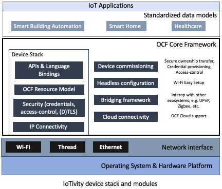

Getting Started
---------------

IoTivity-Lite is a lightweight implementation of the
`Open Connectivity Foundation <https://openconnectivity.org/>`_ (OCF) standards
for the Internet of Things (IoT).

It was designed to build secure and interoperable IoT applications in full
compliance with the
`OCF specifications <https://openconnectivity.org/developer/specifications>`_
with a limited footprint not exceeding the needs of the specifications. The
stack architecture lends itself to be ported rapidly to any chosen hardware/OS
environment.

IoT applications may be built for a wide variety of rich and resource-constrained
devices across the IoT landscape. As a general guideline, it should be feasible
to deploy applications on class 2 constrained devices (>256KB Flash, >64KB RAM),
or better.

The project is open-source, and its code is distributed under the
commercial-friendly Apache v2 license.

Contents
--------

- `IoTivity-Lite Architecture`_
- `Project directory structure`_
- `Setup source tree`_
- `Building sample applications on Linux`_
- `Framework configuration`_

IoTivity-Lite Architecture
---------------------------------

IoTivity-Lite's design presents the following features:

- **OS agnostic core**: This cross-platform core (written in pure C)
  encompasses the APIs, OCF resource model, protocol, security features,
  memory management and event loop. The core interacts
  with lower level platform-specific functionality via a very limited
  collection of abstract interfaces. Such a decoupling of the common
  OCF standards related functionality from adaptations to any OS/target
  facilitates greater ease of long-term maintenance and evolution of
  the stack through successive releases of the OCF specifications.

- **Platform abstraction**: These are a collection of abstract interfaces
  with a small set of hooks to platform-specific features. These interfaces
  are defined in generic terms and elicit a specific contract from
  implementations. The core calls into these interfaces to interact with
  the underlying OS/platform. The simplicity and boundedness of these
  interface definitions allow them to be rapidly implemented on any chosen
  OS/target. Such an implementation then constitutes a "port". A number of ports
  (adaptations) currently exist for immediate use, and the project will
  continue to expand this set.

- **Support for static OR dynamic allocation of internal structures**:
  On environments with a C library that supports heap allocation functions,
  the stack can be configured at build-time to use dynamic memory allocation
  to operate without any pre-configured set of memory constraints.

  Alternatively, the stack may be configured to statically allocate all
  internal structures by setting a number of build-time parameters that
  constrain the number of serviceable connections and requests,
  payload sizes, memory pool sizes, timeouts etc.  These
  collectively characterize an acceptable workload for an application.

- **Lightweight design and low complexity**: This is achieved through
  the implementation of functionally cohesive modules, and weak coupling
  between stack layers.

- **Simple C APIs**: The APIs are defined so as to closely align to OCF
  specification constructs aiding greater ease of understanding. Application
  code utilizing these APIs are largely cross-platform as a consequence
  of the design, and can be quickly migrated over to a any other target
  environment.

Project directory structure
---------------------------

api/*
  contains the implementations of client/server APIs, the resource model,
  utility and helper functions to encode/decode
  to/from OCF’s data model, module for encoding and interpreting type 4
  UUIDs, base64 strings, OCF endpoints, and handlers for the discovery, platform
  and device resources.

messaging/coap/*
  contains a tailored CoAP implementation.

security/*
  contains resource handlers that implement the OCF security model.

utils/*
  contains a few primitive building blocks used internally by the core
  framework.

onboarding_tool/*
  contains the sample onboarding tool (OBT).

deps/*
  contains external project dependencies.

deps/tinycbor/*
  contains the tinyCBOR sources.

deps/mbedtls/*
  contains the mbedTLS sources.

patches/*
  contains patches for deps/mbedTLS and need to be applied once.

include/*
  contains all common headers.

include/oc_api.h
  contains client/server APIs.

include/oc_rep.h
  contains helper functions to encode/decode to/from OCF’s
  data model.

include/oc_helpers.h
  contains utility functions for allocating strings and
  arrays either dynamically from the heap or from pre-allocated
  memory pools.

include/oc_obt.h
  contains the collection of APIs for security onboarding
  and provisioning.

port/\*.h
  collectively represents the platform abstraction.

port/<OS>/*
  contains adaptations for each OS.

apps/*
  contains sample OCF applications.

service/*
  contains OCF services

swig/*
  contains instructions and code to build Java language bindings using
  the SWIG tool.

Setup source tree
-----------------

Grab source and dependencies using:

``git clone --recursive https://github.com/iotivity/iotivity-lite.git``

Building sample applications on Linux
-------------------------------------

The entire build is specified in ``port/linux/Makefile``. The output of the
build consists of all static and dynamic libraries, and sample application
binaries which are stored under ``port/linux``.

Run ``make`` for a release mode build without debug output.

Add ``SECURE=0`` to exclude the OCF security layer and mbedTLS. The security
layer is built by default.

Add ``DEBUG=1`` for a debug mode build with verbose debug output.

Add ``TCP=1`` to include support for TCP endpoints and CoAP over TCP (RFC 8323).

Add ``IPV4=1`` to include IPv4 support in the build. Excluding ``IPV4=1``
produces an IPv6-only build.

Add ``CLOUD=1`` to include OCF Cloud in the build. TCP and IPv4
are included too.

Building sample applications on Windows
---------------------------------------

A Visual Studio project file can be found in
``port/windows/vs2015/IoTivity-Lite.sln``. Open the solution file in
Visual Studio 2015 or newer. If the version of Visual Studio is newer a prompt
should pop up asking if you would like to upgrade the visual studio project
files. Agree to upgrade the files.

Select the version of the samples you would like to build. Debug/Release,
x86/x64. From the ``build`` menu select ``Build Solution``.

The samples can be run from Visual Studio by right clicking on the
``SimpleServer`` or ``SimpleClient`` project from the Solution Explorer and
select ``Debug`` > ``Start new instance``. Or the binaries can be run from the
output folder ``port/windows/vs2015/{Debug|Release}/{Win32|x64}/``.

The build options are hard coded into the visual studio project. The project
defaults to using: dynamic memory allocation, OCF security layer is enabled and
built, and IPv4 support is included in the build.

To change the build options the properties page for each project must be modified
Right click on the project select ``Properties`` find 
``C/C++`` > ``Preprocessor`` > ``Preprocessor Definitions`` find the macro
associated with the feature you wish to enable or disable. For example to
disable the OCF security layer find and delete ``OC_SECURITY`` from the 
``Preprocessor Definitions``. The ``Preprocessor Definitions`` must match for
all projects for them to build and run. Due to the difficulty keeping all the
projects matching it is recommended to avoid modifying the
``Preprocessor Definitions`` unless necessary.

Note: The Linux, Windows, and native Android ports are the only adaptation layers
that are actively maintained as of this writing.

Framework configuration
-----------------------

Build-time configuration options for an application are set in ``oc_config.h``.
This needs to be present in one of the include paths.

Pre-populated (sample) configurations for the sample applications for all
targets are present in ``port/<OS>/oc_config.h``.

Onboarding and Provisioning
----------------------------
Runing the onboarding tool
~~~~~~~~~~~~~~~~~~~~~~~~~~~
At this time there are three versions of the onboarding tool.  The command line C version, the
command line Java version, and the GUI Android version. Both command line versions are identical.
It does not matter which version of the onboarding tool is used.

The C version of the onboarding tool can be found in ``<iotivity-lite>/port/linux`` see Linux build
instructions.

A Java version of the onboarding-tool can be found in
``<iotivity-lite>/swig/apps/java_onboarding_tool``

The following instructions assume the onboarding tool has been built and can run.

Simple Step-by-Step guide for onboarding and provisioning
~~~~~~~~~~~~~~~~~~~~~~~~~~~~~~~~~~~~~~~~~~~~~~~~~~~~~~~~~~
This guide assumes you are starting one discoverable device at a time. Multiple devices can be
discovered and onboarded at the same time however it becomes the responsibility of the user to
figure out which UUID belongs to which device.

Once you have successfully onboarded the samples the first time using the following step-by-step
options feel free to RESET the devices and play around with different provisioning options.

The below steps use the command line version of the onboarding tool. The steps for the Android
onboarding tool is very similar but are not described here.

(Step 1) Onboard and Provision the Server
~~~~~~~~~~~~~~~~~~~~~~~~~~~~~~~~~~~~~~~~~~

There are multiple methods to onboard and provision server and client samples.  Below is given one
of the many possible ways the this could be done.

 - start the server sample
 - start onboarding tool it will print a menu with many option
 - Type ``1`` **Enter** to ``Discover un-owned devices``
 - Type ``8`` **Enter** to *Take ownership of device*

   + Type ``0`` **Enter**. If you have multiple unowned devices you will have to select the correct
     device from the list.

 - Type ``4`` **Enter** to ``Discover owned devices`` the device you just took ownership of should be
   listed.
 - Type ``13`` **Enter** to ``Provision ACE2``. There are many ways to properly provision the device.
   This will give instruction for using wildcard provisioning.

   + Type ``0`` **Enter**. If you have multiple unowned devices you will have to select the correct
     device from the list.
   + Type ``1`` **Enter** for an ``auth-crypt`` ACE
   + Type ``1`` **Enter** in response to ``Enter number of resources in this ACE:``
   + Type ``0`` **Enter** in response to ``Have resource href? [0-No, 1-Yes]:``
   + Type ``1`` **Enter** in response to ``Set wildcard resource? [0-No, 1-Yes]:``
   + Type ``2`` **Enter** to select the ``All discoverable resources`` option
   + Type ``0`` **Enter** in response to ``Enter number of resource types [0-None]:``
   + Type ``0`` **Enter** in response to ``Enter number of interfaces [0-None]``
   + Type ``0`` **Enter** for CREATE, ``1`` **Enter** for RETRIEVE, ``1`` **Enter** for UPDATE, 
     ``0`` **Enter** for DELETE, and ``1`` **Enter** for NOTIFY.
   + ``Successfully issued request to provision ACE`` should be printed on the screen upon success

(Step 2) Onboard the client
~~~~~~~~~~~~~~~~~~~~~~~~~~~~
 - start the client sample
 - Type ``1`` **Enter** to ``Discover un-owned devices``
 - Type ``8`` **Enter** to *Take ownership of device*

   + Type ``0`` **Enter**. If you have multiple unowned devices you will have to select the correct
     device from the list.

  - Type ``2`` **Enter** to ``Discover owned devices`` the server and client should be listed

(Step 3) Pair Server and Client
~~~~~~~~~~~~~~~~~~~~~~~~~~~~~~~~
  - Start the client and server samples
  - Type ``12`` **Enter** to ``Provision pair-wise credentials``
  - Type ``0`` **Enter** ``1`` **Enter** to pair the client and server. If you have multiple owned
    devices you will have to select the correct devices from the list.

(Step 4) Restart and Test
~~~~~~~~~~~~~~~~~~~~~~~~~~
The samples should be onboarded and provisioned. Restart the server and then the client they should
discover each other and run without difficulty.

Send Feedback
-------------------------------------------------
Questions
`IoTivity-Lite Developer Mailing List <https://iotivity-dev@lists.iotivity.org>`_

Bugs
`Jira bug reporting website <https://jira.iotivity.org/projects/LITE>`_
