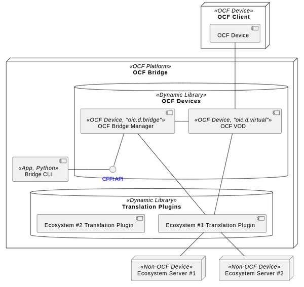
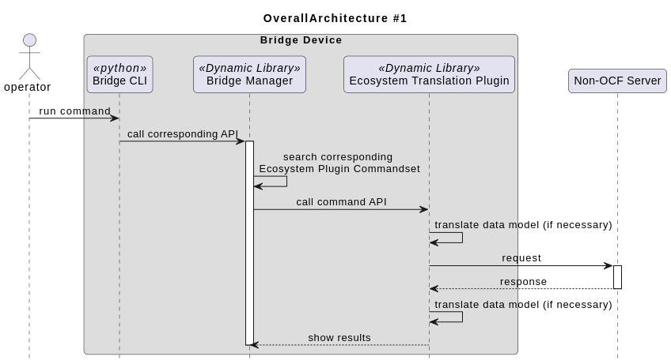
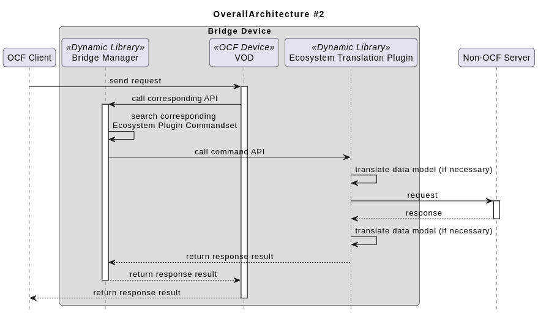
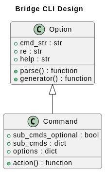
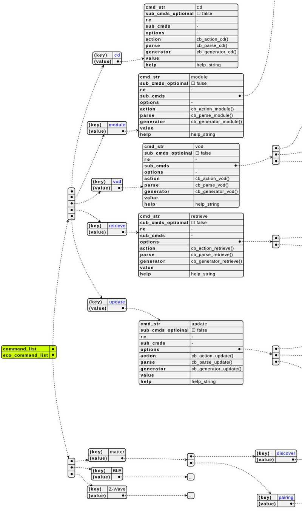
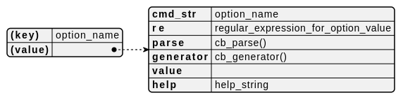
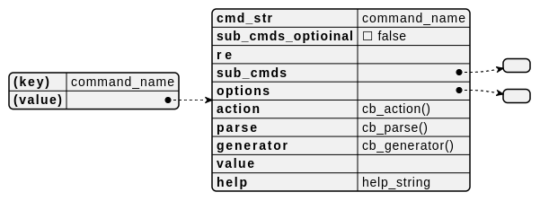

 # Introduction
> Joo-Chul Kevin Lee (rune@etri.re.kr)

- Bridge CLI provides Command Line Interface to operate a bridge platform.
- Bridge CLI is written with Python, and [CFFI](https://github.com/python-cffi/cffi) to interface with [Bridge Manager](./../bridge_manager/readme.md) module.
- Bridge CLI supports plugin structure to add additional commands provided by new ecosystem translation plugin module easily.

	
<br>

## Overall Architecture
### Bridge \<--\> Non-OCF Device

<br>

### OCF Client \<--\> Non-OCF Device

<br>


# How to Build
## Build CFFI glue module to access Bridge Manager
It is necessary to build CFFI glue module to access Bridge Manager module in Bridge CLI. 
Following command generates `bridge_manager.xxx.so` ("xxx" can vary depending on system environment).
`bridge_manager.h` and `libbridge-manager.so` are in [Bridge Manager](./../bridge_manager/readme.md).
```console
$ python cffi_builder.py --header_path <path of "bridge_manager.h"> --module_path <path of "libbridge_manager.so">
```

Refer to [Bridge Manager README](./../bridge_manager/readme.md) to see APIs provided Bridge Manager. 
<br>

# How to Run
## Build Sequences
1. Build & install iotivity-lite library
2. Build Matter Translation plugin module
3. Build Bridge Manager
4. Build CFFI module to access Bridge Manager

## Launch CLI
- Normal mode
	```console
	$ python main.py
	```
- Debug mode (print debug message)
	```console
	$ python main.py -d
	```
<br>

## Supported Commands
### Ecosystem Mode
#### cd { \<econame\> | .. }
```console
cd <econame>
cd ..
```
> Enters specific ecosystem translation plugin mode.
> In this mode, a user can use ecosystem-specific commands provided by the ecosystem translation plugin module. (e.g. `pairing`, etc.)
> If translation plugin module for `<econame>` has not been loaded by `module` command, `<econame>` module is loaded automatically.
- sub-command
	- `econame` : enter ecosystem translation plugin mode
	- `..` : exit from sepcific ecosystem mode
- e.g.
	```console
	bridge> module list
	matter, ble, z-wave
	bridge> cd matter
	bridge> commission
	bridge/matter> cd ..
	bridge>	
	```
<br>

#### module { list | load | unload } \[ \<econame\> \]
```console
module list
module load { <econame>, ... }
module unload { <econame>, ... }
```
> laod/unload ecosystem translation module or list loaded plugin modules.
- sub-command
	- `list` : prints out ecosystem translation plugin modules which are currently loaded.
	- `load` : loads new translation plugin module
	- `unload` : unloads translation module
<br>

### VOD Management
#### vod { list | delete | add { \<vod-name\>, ... } }
```console
vod list
vod delete { <vod-name>, ... }
vod add { <vod-name>, ... }
```
> manages VODs
- sub command
	- `show` : prints out VODs
	- `delete` : removes specific VOD from `oic.r.vodlist:vods` and makes it offline.
	- `add` : adds specific VOD to `oic.r.vodlist:vods` and makes it online. 
		- **Endpoint** information will be changed after being deleted and added, so discovery may be needed again.
<br>

### CRUD operation for VOD
#### retrieve { -name \<device_name\>/\<resource_path\> | -id \<device_id\>/\<resource_path\> }
```console
retrieve -name <device_name>/<resource_path>
retrieve -id <device_id>/<resource_path>
```
> gets Resource Properties
- option: 
	- `-name` | `-id`
<br>

#### update { -name \<device_name\>/\<resource_path\> | -id \<device_id\>/\<resource_path\> } -value { property1:\<value\>, property2:\<value\>, ...  }
```console
update -name <device_name>/<resource_path> -value { property1:<value>, property2:<value>, ...  }
update -id <device_id>/<resource_path> -value { property1:<value>, property2:<value>, ...  }
```
> updates Resource Properties. 
> any json format could be used as an argument of `-value` .
- command: 
	- `update`
- option: 
	- `-name` | `-id`
	- `-value`
<br>

## Commands provided by Ecosystem Translation plugin module
These commands is described in each Plugin readme.
- [Matter Translation plugin](./../matter_translation_plugin/readme.md)
<br>


# How to add a New Commandset for a New Translation plugin
## Command / Option architecture
Each Command / Option is implemented based on Option and Command class.

- `cmd_str (str)` : Command/Subcommand/Option name
- `re (str)` : regular expression to be used for validating argument value
- `help (str)` : help string for this command. 
- `sub_cmds (dict)` : dict of `Command` instance
- `options (dict)` : dict of `Option` instance
- `parse (callable)` : method to evaluate argument value
- `generator (callable)` : method to generate candidate values for current token
- `action (callable)` : method to run command

### Commands Dictionary

- `command_list (dict)` : dict of common commands
- `eco_command_list (dict)` : dict of ecosystem specific commands

### Option class


### Command class

<br>

## Adding Commands for New Ecosystem plugin module
1. create sub-folder for new ecosystem plugin module (folder name should be same as `<econame>`, e.g. `matter`) under `plugins` folder.
3. create python file (`cli.py`) in that folder and implement new dict for ecosystem translation plugin module specific commands. The name of new dict should be `commands`.
	- import `common/command` package
4. implement **parser**, **generator**, and **action** callback function for each command.
	- Functions called by python codes are provided by [Bridge Manager](./../bridge_manager/readme.md)
