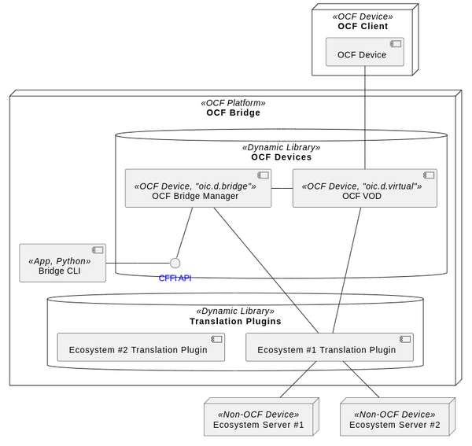

# Introduction
> Joo-Chul Kevin Lee (rune@etri.re.kr)

- Bridge Manager manages Ecosystem translation plugin modules.
- Bridge Manager manages VODs list Resources.
- Bridge Manager manages VODs state machine.
- Bridge Manager interacts with CLI.
 

<br>

# How to Build
Bridge Manager uses **Gn (Generate Ninja) / Ninja** build system.

## Install Gn
There are several ways to install GN. 
1. download & install from [here](https://gn.googlesource.com/gn/)
2. download & install [matter SDK](https://github.com/project-chip/connectedhomeip), and do `$ source scripts/activate.sh`
3. `$ apt install generate-ninja`

Way #2 is recommended.

## Install ninja
1. download & install [matter SDK](https://github.com/project-chip/connectedhomeip), and do `$ source scripts/activate.sh`
2. `$ apt install ninja-build`

Way #1 is recommended.

## Install iotivity-lite library
install iotivity-lite library : follow normal iotivity-lite build & install procedure (should enable Bridging feature)
```console
$ cd build
$ cmake --build .
$ sudo cmake --install .
```

## Install required Library
```console
$ sudo apt install libjansson-dev
```

## Build
1. create build directory (typically `out`)
2. `$ gn gen out`
3. `$ ninja -C out` : 
	- `libbridge_manager.so` will be created in `out` folder
	- to enable log messages, uncomment `OC_BRG_DEBUG` in **BUILD.gn** file
4. edit `settings.json` in **Bridge CLI** folder :
	- edit "`pluginPath`" with path where all Ecosystem Translation plugin module folders exist (absolute path should be used).
		```json
		// example
		{
		  "pluginPath": "/home/jclee/iotivity-lite/matter_cli/plugins"
		}

		// example folder structure
		// matter_cli
		// 	|__plugins
		// 		 |__matter
		// 		 |__ble
		// 		 |__z-wave
		```
<br>

# API \& Data Structures
## Data Structures
### Json structure passed from Bridge CLI
Bridge CLI passes command information as serialized json string as follows:
- Json format: 
	```json
	{
		"cmd" : {
			"cmd_str" : "command name string",
			"value" : <value for command>
		},
		"subcmd" : {
			"cmd_str" : "subcommand name string",
			"value" :  <value for subcommand>
		},
		"options" : [
			{
				"cmd_str" : "option #1 name string",
				"value" : <value for option>
			},
			{
				"cmd_str" : "option #2 name string",
				"value" : <value for option>
			}
		],
		"econame" : "matter"
	}
	```

- example: 
	```cpp
	// example: 
	// e.g.) pairing unpair 0x10
	{
		"cmd" : {
			"cmd_str" : "pairing",
			"value" : null
		},
		"subcmd" : {
			"cmd_str" : "unpair",
			"value" :  [ "0x10" ]
		},
		"options" : [],
		"econame" : "matter"
	}
	```

### Function Pointers for Callback
Each non-OCF ecosystem translation plugin should implement and register their own callback function set to the Bridge Manager. Those callback function sets are managed by the Bridge Manager and each callback function set is implemented with `ecosystem_cli_commandset_t` structure. Following function pointers are used to define `ecosystem_cli_commandset_t` instance.

#### cb_ecosystem_command_t()
```cpp
/**
 * @brief callback for other ecosystem specific commands
 *
 * @param parsed_command_json_str Serialized json string stream including "vod" command info typed by a user
 * @return 0: success, <0: failure
 */
typedef int (*cb_ecosystem_command_t)(const char *parsed_command_json_str);
```
> run specific ecosystem command

#### cb_init_plugin_t()
```cpp
/**
 * @brief callback to initiate ecosystem translation plugin
 *
 * @param cli_commandset Ecosystem-specific commandset which should be completed by plugin
 * @return 0: success, <0: failure
 */
typedef int (*cb_init_plugin_t)(ecosystem_cli_commandset_t *cli_commandset);
```
> init plugin module

#### cb_shutdown_plugin_t()
```cpp
/**
 * @brief callback to shutdown ecosystem translation plugin
 *
 * @param cli_commandset Ecosystem-specific commandset which should be cleaned by plugin
 * @return 0: success, <0: failure
 */
typedef int (*cb_shutdown_plugin_t)(ecosystem_cli_commandset_t *cli_commandset);
```
> shutdown plugin module

<br>

### Callback Function Set
#### cli_command_t
```cpp
/*---------------------------------------------------------------------------*/
/*
 * structs for each ecosystem-specific commandset
 */
/*---------------------------------------------------------------------------*/

/**
 * @brief ecosystem specific command
 */
typedef struct cli_command {
  struct cli_command *next;
  oc_string_t cmd_str;          ///< ecosystem specific command string
  cb_ecosystem_command_t func;  ///< callback to handle this command
} cli_command_t;
```
> Each ecosystem specific command is defined by this struct

#### ecosystem_cli_commandset_t
```cpp
/**
 * @brief ecosystem commandset
 */
typedef struct ecosystem_cli_commandset {
  struct ecosystem_cli_commandset *next;

  oc_string_t econame;                ///< ecosystem name providing these command set (set by plugin)
  cb_init_plugin_t init;              ///< callback to init this ecosystem translation plugin (set by bridge_manager)
  cb_shutdown_plugin_t shutdown;      ///< callback to shutdown this ecosystem translation plugin (set by bridge_manager)
  cb_ecosystem_command_t retrieve;    ///< callback to retrieve data from ecosystem server (set by plugin)
  cb_ecosystem_command_t update;      ///< callback to update data in ecosystem server (set by plugin)
  OC_LIST_STRUCT(eco_commands);       ///< callbacks for ecosystem-specific commands (e.g. discover, pairing...) (set by plugin)
  void *dl_plugin_handle;             ///< plugin handle (set by bridge_manage)
} ecosystem_cli_commandset_t;
```
- Each ecosystem translation plugin module should complete this and return this to the **Bridge Manager**.
- An Ecosystem translation plugin module should expose `InitPlugin()` and `ShutdownPlugin()` :
	- When the Bridge Manager loads an ecosystem translation module, it creates an `ecosystem_cli_commandset_t` instance and calls `InitPlugin()` with the created `ecosystem_cli_commandset_t` instance.
	- The ecosystem translation plugin module should complete remaining fields of `ecosystem_cli_commandset_t` instance except for `init`, `shutdown`, `dl_plugin_handle`.
	- The ecosystem translation plugin module may do other initialization works in `InitPlugin()`.
<br>

## APIs exposed by The Bridge Manager
### init_bridge_manager()
```cpp
/*-----------------------------------------------------------------------------*/
/*
 * bridge manager interface APIs
 */
/*-----------------------------------------------------------------------------*/
/**
 * @brief initialize bridge_manager
 * @return 0: success, <0: failure
 */
OC_API int init_bridge_manager(void);
```
> Initialize Bridge Manager (Run iotivity-lite main loop)

### shutdown_bridge_manager()
```cpp
/**
 * @brief shutdown bridge_manager
 * @return none
 */
OC_API void shutdown_bridge_manager(void);
```
> Shutdown Bridge Manager (closing all Ecosystem Translation plugin modules and destory resources related to them)

### vod()
```cpp
/*---------------------------------------------------------------------------*/
/*
 *  vod command
 */
/*---------------------------------------------------------------------------*/
/**
 * @brief "vod" command handler
 *
 * @param parsed_command_json_str Serialized json string stream including "vod" command info typed by a user
 * @return NULL: error, non NULL: Serialized json string stream including list of VODs
 */
OC_API char *vod(char *parsed_command_json_str);
```
> Gets VOD list and returns it to CLI

### cd()
```cpp
/*---------------------------------------------------------------------------*/
/*
 *  cd command
 */
/*---------------------------------------------------------------------------*/
/**
 * @brief "cd" command handler (used to enter specific ecosystem CLI mode)
 *
 * @param module_name Name of a plugin module (e.g. "matter")
 * @return 0: success, <0: failure
 */
OC_API int cd(char *module_name);
```
> Enter to or Exit from specific Ecosystem Translation plugin mode

### module()
```cpp
/*---------------------------------------------------------------------------*/
/*
 *  module command
 */
/*---------------------------------------------------------------------------*/
/**
 * @brief "module" command handler
 *
 * @param parsed_command_json_str Serialized json string stream including "module" command info typed by a user
 * @return 0: success, <0: failure
 */
OC_API int module(char *parsed_command_json_str);
```
> load / list / unload any Ecosystem Translation plugin module

### retrieve()
```cpp
/*---------------------------------------------------------------------------*/
/*
 *  retrieve command
 */
/*---------------------------------------------------------------------------*/
/**
 * @brief "retrieve" command handler
 *
 * @param parsed_command_json_str Serialized json string stream including "retrieve" command info typed by a user
 * @return 0: success, <0: failure
 */
OC_API int retrieve(char *parsed_command_json_str);
```
> Gets any Resource contents of VOD

### update()
```cpp
/*---------------------------------------------------------------------------*/
/*
 *  update command
 */
/*---------------------------------------------------------------------------*/
/**
 * @brief "update" command handler
 *
 * @param parsed_command_json_str Serialized json string stream including "update" command info typed by a user
 * @return 0: success, <0: failure
 */
OC_API int update(char *parsed_command_json_str);
```
> Updates any Resource contents of VOD

### run_ecosystem_command()
```cpp
/*---------------------------------------------------------------------------*/
/*
 *  Ecosystem specific command
 */
/*---------------------------------------------------------------------------*/
/**
 * @brief Run ecosystem specific command
 *
 * @param parsed_command_json_str Serialized json string stream including ecosystem-specific command info typed by a user
 * @return 0: success, <0: failure
 */
OC_API int run_ecosystem_command(char *parsed_command_json_str);
```
> Runs any Ecosystem specific commands

<br>