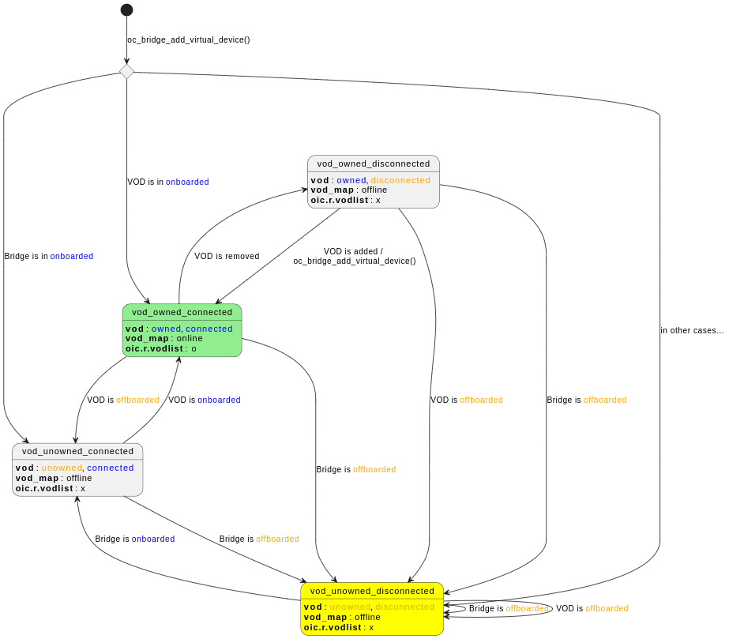
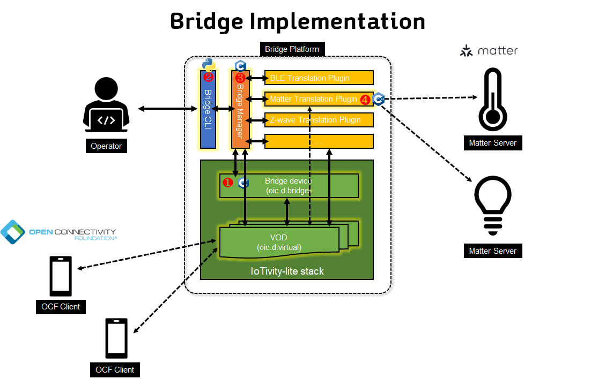

# Introduction
> Joo-Chul Kevin Lee (rune@etri.re.kr)

OCF provides bridging feature to support interaction with other NON-OCF ecosystem devices. 

## VOD (Virtual OCF Device)
- OCF Briding feature is based on **VOD (Virtual OCF Device)** concept.
- A VOD an OCF Device which is exactly same as a normal OCF Device except that it represents non-OCF Device and it has additional device type value (i.e. "`oic.d.virtual`"). This additional device type can help users to distinguish VODs from other normal OCF Devices.

## VOD vs. Bridge Device
- **Bridge Device** is another special OCF Device used to manage VODs. It also has additional device type value (i.e. "`oic.d.bridge`") to identify it from other normal OCF Devices. An OCF Platform works as a Bridge should have one Bridge Device. 
- VODs have dependency on a Bridge Device for security reason. In the initial state (the Bridge Device has not been onboarded yet) all other VODs shall be reset state, so they can't be onboarded until the Bridge Device is onboarded. Once the Bridge Device is onboarded all VODs become online and they are ready to be onboarded (RFOTM). If the Bridge Device is reset all otxher VODs shall be reset too (they shall be in RFOTM state). Below figure shows the state diagram of VOD.

	)
## VOD list Resource
- VOD list Resource (rt : "`oic.r.vodlist`") maintains the list of current onboarded VODs. It has an array property ("`vods`") which keeps the list of VOD information ("`vodentry`"). Each `vodentry` has 3 Properties: `name`, `Device ID`, `econame`. VOD list Resource is managed by the Bridge Device ("`oic.d.bridge`"). 
	```json
	"vodentry" : {
		"description": "Information for a VOD created by the Bridge",
		"type": "object",
		"properties": {
			"n": {
			  "$ref": "https://openconnectivityfoundation.github.io/core/schemas/oic.common.properties.core-schema.json#/definitions/n"
			},
			"di" : {
			  "$ref": "https://openconnectivityfoundation.github.io/core/schemas/oic.types-schema.json#/definitions/uuid"
			},
			"econame": {
				"description": "Ecosystem Name of the Bridged Device which is exposed by this VOD",
				"type": "string",
				"enum": [ "Matter", "BLE", "oneM2M", "UPlus", "Zigbee", "Z-Wave", "EnOcean", "AllJoyn", "LWM2M" ],
				"readOnly": true
			}
		}
	}

	/* vod list Resource */
	"vodlist": {
		"rt" :  {
			"description": "Resource Type",
			"items": {
				"maxLength": 64,
				"type": "string",
				"enum": ["oic.r.vodlist"]
			},
			"minItems": 1,
			"uniqueItems": true,
			"readOnly": true,
			"type": "array"
		},
		"vods": {
			"description": "Array of information per VOD created by the Bridge",
			"type": "array",
			"minItems": 0,
			"uniqueItems": true,
			"readOnly": true,
			"items": {
				"$ref": "#/definitions/vodentry"
			}
		}
	}
	```
<br>

# Bridge Framework Implementation in iotivity-lite
Bridge Framework implementation in iotivity-lite is composed of following components:

## Iotivity-lite Bridging feature : 
- supports VOD feature in iotivity-lite stack

## [Bridge Manager](./../bridge_manager/readme.md) : 
- manages ecosystem translation plugin modules
- manages VODs list Resources
- manages VODs state machine
- interacts with CLI

## [Bridge CLI](./../bridge_cli/readme.md) :
- operates ecosystem translation plugins
- handles CRUDN request from users

## [Translation Plugin per each Non-OCF Ecosystem](./../matter_translation_plugin/readme.md)
- does OCF Server role
- does non-OCF Client role
- does data model translation
- pairing/unpairing non-OCF Devices


<br>

# How to enable Bridging feature of iotivity-lite
- CMake
	```cmake
	OC_DYNAMIC_ALLOCATION_ENABLED = ON
	OC_BRIDGE_ENABLED = ON
	```

- Makefile
	```console
	$ make BRIDGE=1 DYNAMIC=1
	$ sudo make BRIDGE=1 DYNAMIC=1 install
	```
<br>

# API
## oc_bridge_add_bridge_device()
Adds Bridge Device ("`oic.d.bridge`").
```cpp
/**
 * Add an oic.d.bridge device.
 *
 * The oic.r.vodlist resource will be registered to the bridge device.
 *
 * @param[in] name the user readable name of the device
 * @param[in] spec_version The version of the OCF Server.
 *                       This is the "icv" device property
 * @param[in] data_model_version Spec version of the resource and device
 *                               specifications to which this device data model
 *                               is implemented. This is the "dmv" device
 *                               property
 * @param[in] add_device_cb callback function invoked during oc_add_device().
 *                          The purpose is to add additional device properties
 *                          that are not supplied to
 *                          oc_bridge_add_bridge_device() function call.
 * @param[in] data context pointer that is passed to the oc_add_device_cb_t
 *
 * @return
 *   `0` on success
 *   `-1` on failure
 */
OC_API
int oc_bridge_add_bridge_device(const char *name, const char *spec_version,
                                const char *data_model_version,
                                oc_add_device_cb_t add_device_cb, void *data);
```

## oc_bridge_add_virtual_device()
Adds a VOD to the stack.
```cpp
/**
 * Add a virtual ocf device to the the stack.
 *
 * This function is called to add a newly discovered non-ocf device to a bridge
 * device. This will typically be called in response to the non-ocf devices
 * discovery mechanism.
 *
 * The `oc_bridge_add_virtual_device()` function may be called as many times as
 * needed.  Each call will add a new device to the stack with its own port
 * address. Each device is automatically assigned a device index number. Unlike
 * the `oc_add_device()` function this number is not incremented by one but
 * assigned an index number based on avalibility.  The index assigned to the
 * virtual device will be returned from the function call. The function
 * `oc_bridge_get_virtual_device_index()` can also be used to get the logical
 * device index number after this function call.
 *
 * The function `oc_bridge_add_bridge_device()` must be called before this
 * function.
 *
 * @param virtual_device_id a unique identifier that identifies the virtual
 *                          device this could be a UUID, serial number or other
 *                          means of uniquely identifying the device
 * @param virtual_device_id_size size in bytes of the virtual_device_id param
 * @param econame ecosystem name of the bridged device which is exposed by this
 *                virtual device
 * @param uri the The device URI.  The wellknown default URI "/oic/d" is hosted
 *            by every server. Used to device specific information.
 * @param rt the resource type
 * @param name the user readable name of the device
 * @param spec_version The version of the OCF Server.  This is the "icv" device
 *                     property
 * @param data_model_version Spec version of the resource and device
 *                           specifications to which this device data model is
 *                           implemented. This is the "dmv" device property
 * @param add_device_cb callback function invoked during oc_add_device(). The
 *                      purpose is to add additional device properties that are
 *                      not supplied to oc_add_device() function call.
 * @param data context pointer that is passed to the oc_add_device_cb_t
 *
 * @return
 *   - the logical index of the virtual device on success
 *   - `0` on failure since a bridge device is required to add virtual devices
           a zero index cannot be assigned to a virtual device.
 *
 * @note device index is cast from size_t to int and may lose information.
 *       The `oc_bridge_add_virtual_device()` function can be used to get
 *       the non-cast device index.
 * @note The function `oc_bridge_add_bridge_device()` must be called before this
 *       function.
 *
 * @see init
 */
OC_API
size_t oc_bridge_add_virtual_device(
  const uint8_t *virtual_device_id, size_t virtual_device_id_size,
  const char *econame, const char *uri, const char *rt, const char *name,
  const char *spec_version, const char *data_model_version,
  oc_add_device_cb_t add_device_cb, void *data);
```

## oc_bridge_add_vod()
Adds new vodentry to the VOD list Resource ("`oic.r.vodlist`")
```cpp
/**
 * @brief add new vodentry for an existing VOD to "oic.r.vodlist:vods".
 *        This function is usually called after `oc_bridge_remove_virtual_device()`
 *        is called.
 *        This function DOES NOT add new Device to `g_oc_device_info[]`, but
 *        just re-registre existing VOD to "oic.r.vodlist:vods" list.
 *
 * @param device_index Device index of VOD to be online
 * @return 0: success, -1: failure
 */
OC_API
int oc_bridge_add_vod(size_t device_index);
```

## oc_bridge_remove_virtual_device()
Removes a VOD from the VOD list Resource ("`oic.r.vodlist`") and shutdown connectivity of it.
```cpp
/**
 * If the non-ocf device is no longer reachable this can be used to remove
 * the virtual device from the bridge device.
 *
 * This will shutdown network connectivity for the device and will update
 * the vodslist resource found on the bridge.
 *
 * Any any persistant settings will remain unchanged.  If the virtual device has
 * already been onboarded and permission settings have been modified when the
 * device is added again using `oc_bridge_add_virtual_device` those
 * persistant settings will still be in place.
 *
 * @param device_index the index of the virtual device
 *
 * @return
 *   - `0` on succes
 *   - `-1` on failure
 */
OC_API
int oc_bridge_remove_virtual_device(size_t device_index);
```

## oc_bridge_delete_virtual_device()
Removes a VOD from the stack and the VOD list Resource ("`oic.r.vodlist`").
```cpp
/**
 * This will remove the virtual device and free memory associated with that
 * device.
 *
 * Delete virtual device will remove all persistant settings. If the virtual
 * device is added again the onboarding and device permissions will need to be
 * setup as if the device were a new device.
 *
 * @param device_index index of teh virtual device
 *
 * @return
 *   - `0` on success
 *   - `-1` on failure
 */
OC_API
int oc_bridge_delete_virtual_device(size_t device_index);
```