# OCF Push Notification

## Introduction
OCF Push Notification lets devices send notifications to other devices without any initial request such as what observation does.
OCF Push Notification is composed of 3 players: **Origin Server**, **Target Server**, **Configuration Client**. 

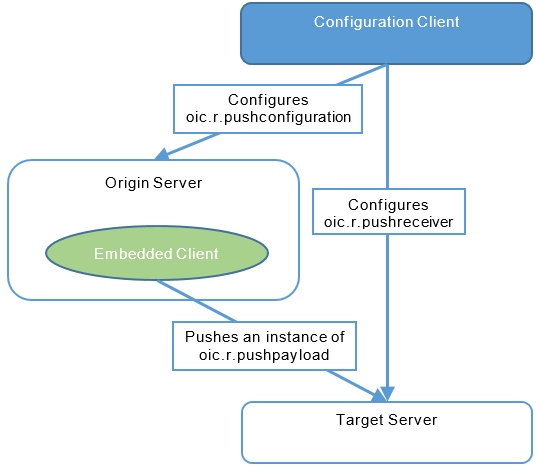
- **Origin Server**: 
	- An origin Server hosts pushable Resources (3rd LSB of "bm:p" of pushable Resource is 1) and sends push update requests to target Servers.
	- An origin Server maintains "Push Configuration Resource" (`"oic.r.pushconfiguration"`) which keeps following information:
		- Resources to be pushed.
		- A Target to which the contents of a Resource will be pushed. 
		- A push configuration Resource is a collection Resource. 
	- An OCF Device which plays origin Server role does play Client role too, because it sends push updates to target servers. 
- **Target Server**:
	- A target Server receives push update requests from a origin Server. 
	- A target Server maintains "Push receiver Resource" (`"oic.r.pushreceiver"`) which keeps filtering information for incoming push update requests. It filters Resource type of Resource included in the incoming push update requests and filters target path to which pushed Resource will be stored. 
- **Configuration Client**:
	- A configuration client updates push configuration Resource in origin Servers and push receiver Resource in target Servers.
<br>

## How to enable PUSH Notification
### build configuration
- makefile
	```bash
	# - if PUSH_DEBUG=1 and DEBUG=0, only push notification debug messages are printed
	# - if DEBUG=1, push notification debug messages and all other debug messages are printed
	# - DYNAMIC=1 is default, so you can omit it
	$ make PUSH=1 (PUSH_DEBUG=1) CREATE=1 DYNAMIC=1
	$ sudo make PUSH=1 (PUSH_DEBUG=1) CREATE=1 DYNAMIC=1 install
	```
- cmake
	```text
	OC_COLLECTIONS_IF_CREATE_ENABLED = 1
	OC_DYNAMIC_ALLOCATION_ENABLED = 1
	OC_PUSH_ENABLED = 1
	```
<br>

## How to run samples
### 3 Examples
- `push_configurator_multithread_linux`: **Configuration Client**

	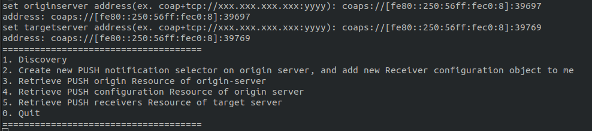

- `push_originserver_multithread_linux`: **Origin Server**

	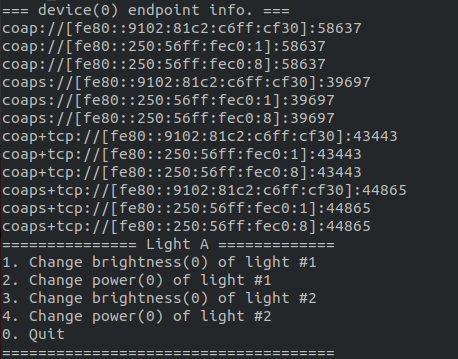

- `push_targetserver_multithread_linux`: **Target Server**

	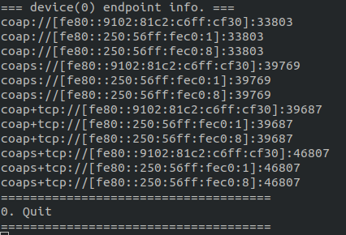

### Onboarding
- If you want quick test, build iotivity-lite without security (`OC_SECURITY_ENABLED=1` or `SECURE=0`).
- If iotivity-lite is built with security, refer to following steps: 
	1. add ACE to eath of them (use wildcard provisioning)
		- allow all ACE permissions (CRUDN)
	3. pair `Configuration Client` and `Origin Server` and `Target Server`
		- pair `Configuration Client` and `Origin Server`: let **Configuration Client** updates **push configuration Resource**
		- pair `Configuration Client` and `Target Server`: let **Configuration Client** updates **push receiver Resource**
		- pair `Origin Server` and `Target Server`: let **Origin Server** send push update request to **Target Server**
- please refer to [README.rst](../../README.rst) for detaild onboarding procedure.

### Run examples
- **Configuration Client**
	1. Discovery: 
		find pushable Resource of "oic.r.custom.light" type.
		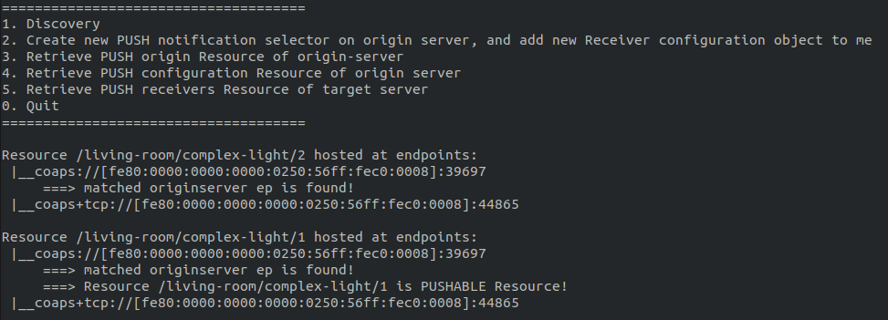
	2. Create new PUSH notification selector on origin server, and add new Receiver configuration object to target server: 
		create / update related configuration Resources.
		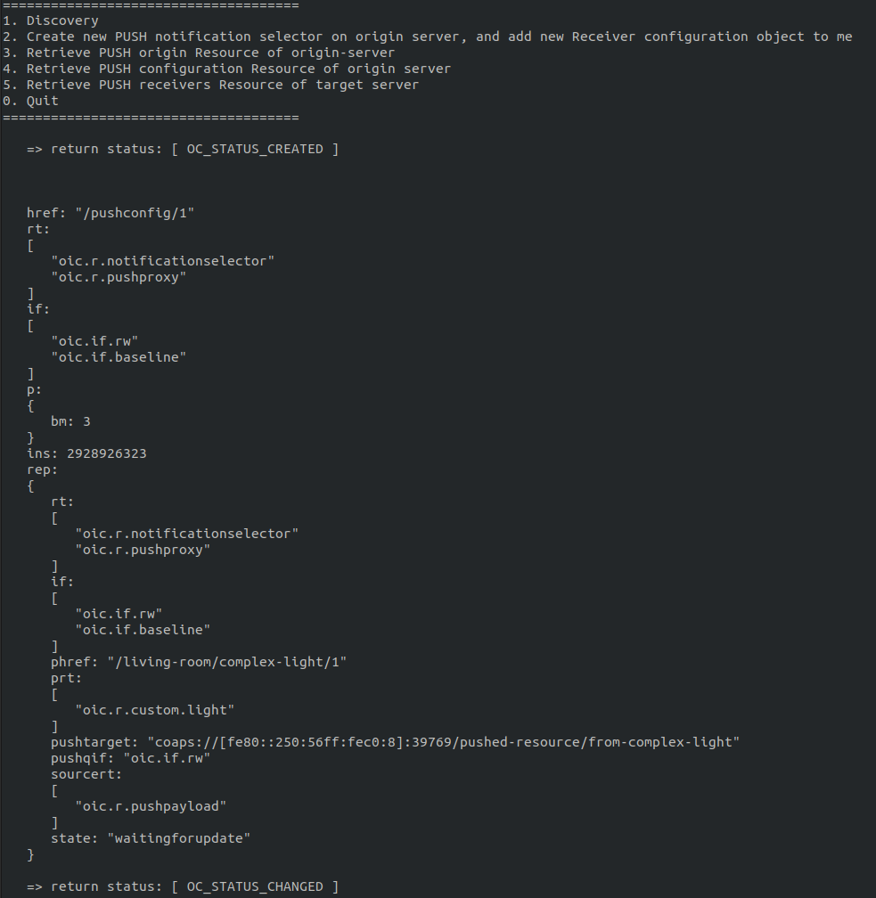
	3. Retrieve PUSH configuration Resource of origin server
		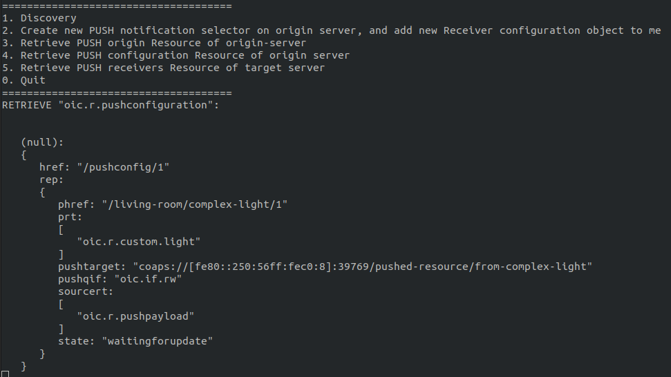
	4. Retrieve PUSH receivers Resource of target server
		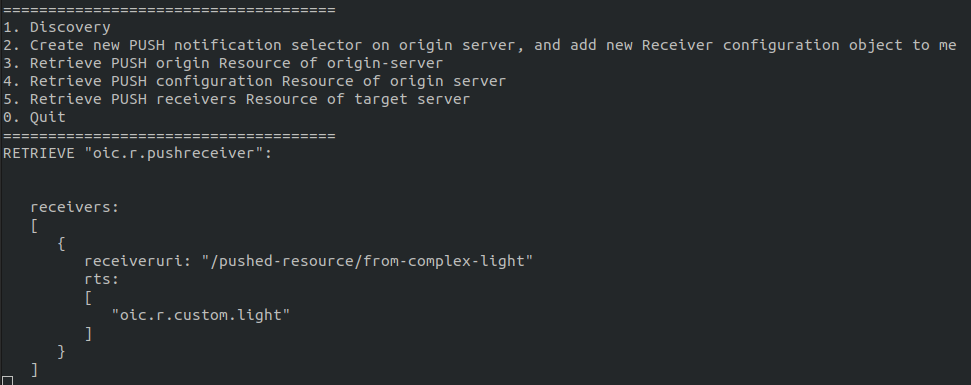
	6. Retrieve PUSH origin Resource of origin-server
		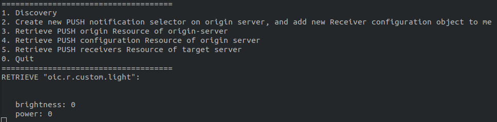
	
- **Origin Server**
	Change Contents of pushable Resource: press `1` or `2`.
	
- **Target Server**
	- Whenever press `1` or `2` at Origin Server, you can see following screen.
		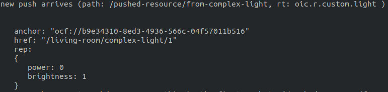
		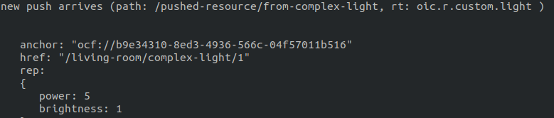
	- press `3` or `4` at Origin Server, you can see nothing changed.
<br>

## API
### Origin Server

- `oc_resource_set_pushable()`
	```c
	/**
	 * Specify if a resource can be pushable.
	 *
	 * @param[in] resource to specify as pushable or non-pushable
	 * @param[in] state if true the resource will be pushable if false the
	 *                  resource will be non-pushable
	 */
	void oc_resource_set_pushable(oc_resource_t *resource, bool state);
	```
	- Call this function once when you create new pushable Resource.
- `oc_resource_t.payload_builder`
	```c
	struct oc_resource_s
	{
	  struct oc_resource_s *next;            ///< next resource
	  size_t device;                         ///< device index
	  oc_string_t name;                      ///< name of the resource (e.g. "n")
	  oc_string_t uri;                       ///< uri of the resource
	  oc_string_array_t types;               ///< "rt" types of the resource
	  oc_interface_mask_t interfaces;        ///< supported interfaces
	  oc_interface_mask_t default_interface; ///< default interface
	  oc_resource_properties_t properties;   ///< properties (as bit mask)
	  oc_request_handler_t get_handler;      ///< callback for GET
	  oc_request_handler_t put_handler;      ///< callback for PUT
	  oc_request_handler_t post_handler;     ///< callback for POST
	  oc_request_handler_t delete_handler;   ///< callback for DELETE
	  oc_properties_cb_t get_properties;     ///< callback for get properties
	  oc_properties_cb_t set_properties;     ///< callback for set properties
	  double tag_pos_rel[3];                 ///< tag relative position [x,y,z]
	  oc_pos_description_t tag_pos_desc; ///< tag (value) for position description
	  oc_enum_t tag_func_desc;           ///< tag (value) for function description
	  oc_locn_t tag_locn;                ///< tag (value) for location description
	  uint8_t num_observers;             ///< amount of observers
	#ifdef OC_COLLECTIONS
	  uint8_t num_links; ///< number of links in the collection
	#if defined(OC_PUSH) && defined(OC_SERVER) && defined(OC_CLIENT) &&            \
	  defined(OC_DYNAMIC_ALLOCATION) && defined(OC_COLLECTIONS_IF_CREATE)
	  oc_payload_callback_t
		payload_builder; ///< callback to build contents of PUSH Notification
	#endif
	#endif                             /* OC_COLLECTIONS */
	  uint16_t observe_period_seconds; ///< observe period in seconds
	};
	```
	- Callback function pointer. This function is necessary to build contents of push update request.
	- When iotivity-lite builds contents of push update request, it calls this function.
	- Example: 
		```c
		/* PUSH payload builder example */
		void build_light_payload()
		{
			oc_rep_open_object(root, rep);
			oc_rep_set_int(rep, power, power);
			oc_rep_set_int(rep, brightness, brightness);
			oc_rep_close_object(root, rep);
		}
		```
- `oc_resource_state_changed()`
	```c
	/**
	 * @brief application should call this function whenever the contents of
	 * pushable Resource is updated, or Push Notification will not work.
	 *
	 * @param[in] uri          path of pushable Resource whose contents is just
	 * updated
	 * @param[in] device_index index of Device that updated pushable Resource
	 * belongs to
	 */
	OC_API
	void oc_resource_state_changed(const char *uri, size_t device_index);
	```
	- User apps should call this function whenever contents of pushable Resource is changed.
	- Example:
		```c
		/* example */
		static void change_brightness(void)
		{
			brightness = (brightness+1)%100;
			/* notify PUSH origin Resource is changed */
			oc_resource_state_changed(resource_uri, res->device);
		}
		```

### Target Server
- `oc_set_on_push_arrived()`
	```c
	/**
	 * @brief object used to store Resource pushed to
	 * "oic.r.pshreceiver:receivers[i].receiveruri"
	 */
	typedef struct oc_pushd_rsc_rep
	{
	  struct oc_pushd_rsc_rep *next;
	  oc_resource_t
		*resource;   ///< used to point any pushed Resource managed by iotivity-lite
	  oc_rep_t *rep; ///< payload of pushed Resource
	} oc_pushd_rsc_rep_t;

	/**
	 * @brief callback function called whenever new push arrives
	 */
	typedef void (*oc_on_push_arrived_t)(oc_pushd_rsc_rep_t *);

	/**
	 * @brief set callback function called whenever new push arrives
	 *
	 * @param[in] func function name
	 */
	OC_API
	void oc_set_on_push_arrived(oc_on_push_arrived_t func);
	```
	- Use this function to set callback function which will be called whenever new push update request arrives.
	- Example:
		```c
		/* callback function example */
		void push_arrived(oc_pushd_rsc_rep_t *push_payload)
		{
		  printf("new push arrives (path: %s, rt: ", oc_string(push_payload->resource->uri));
		  for (size_t i=0; i<oc_string_array_get_allocated_size(push_payload->resource->types); i++)
		  {
			printf("%s ", oc_string_array_get_item(push_payload->resource->types, i));
		  }
		  printf(")\n");

		  oc_print_pushd_rsc(push_payload->rep);
		}
		```

### Common
- Header file
	```c
	#include "oc_push.h"
	```
- `oc_print_pushd_rsc()`
	```c
	/**
	 * @brief print payload of Resource in user friendly format
	 *
	 * @param[in] payload pointer to the payload to be printed
	 */
	OC_API
	void oc_print_pushd_rsc(const oc_rep_t *payload);
	```
	- print out payload contents.
<br>