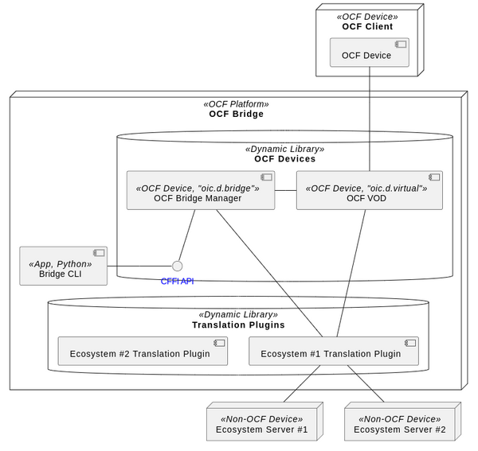

# Introduction
> Joo-Chul Kevin Lee (rune@etri.re.kr)

- Matter Translation plugin does OCF Server role.
- Matter Translation plugin does Matter Client role.
- Matter Translation plugin does data model translation b/w OCF Resource model and Matter Cluster model.
- Matter Translation plugin does pairing/unpairing Matter Devices.

	

# How to Build
Matter Translation plugin module uses **Gn (Generate Ninja) / Ninja** build system.

## Download Matter SDK
1. download & extract [matter SDK](https://github.com/project-chip/connectedhomeip) to specific folder.
	**Matter SDK version ++1.1.0.1++ should be used. Higher version has not been tested.**
3. create symbolic link to the matter sdk source root folder in `matter_translation_plugin/third_party`. symbolic link name should be `connectedhomeip`.

## Install Gn
There are several ways to install GN. 
1. download & install from [here](https://gn.googlesource.com/gn/)
2. download & install [matter SDK](https://github.com/project-chip/connectedhomeip), and do `$ source scripts/activate.sh`
3. `$ apt install generate-ninja`

Way #2 is recommended.

## Install ninja
1. download & install [matter SDK](https://github.com/project-chip/connectedhomeip), and do `$ source scripts/activate.sh`
2. `$ apt install ninja-build`

Way #1 is recommended.

## Install iotivity-lite library
install iotivity-lite library : follow normal iotivity-lite build & install procedure (bridging feature should be enabled)
```console
$ cd build
$ cmake --build .
$ sudo cmake --install .
```

## Install required Library
```console
$ sudo apt install libjansson-dev
$ sudo apt install libjsoncpp-dev
```

## Build
1. edit gn argument `bridge_manager_root` in `matter_translation_plugin/build_overrides/build.gni` : 
	its value should be the root source directory of Bridge Manager.
	```gn
	// example:
	declare_args() {
		bridge_manager_root = "/home/jclee/Development/Matter/WS_Matter/bridge_manager"
	}
	```
2. create build directory (typically `out`)
3. `$ gn gen out`
4. `$ ninja -C out` : 
	- `matter_translator_plugin.so` will be created in `out` folder
	- to enable log messages of Matter Translation plugin, uncomment `OC_BRG_DEBUG` in **BUILD.gn** file
	- to enable log messages of Matter Client, make following argument `true` in **out/args.gn** file
		```gn
		chip_detail_logging=false
		chip_progress_logging=false
		chip_error_logging=false
		```
5. copy `matter_translator_plugin.so` to `plugins/matter` folder of Bridge CLI (refer to [Bridge CLI - Adding Commands for New Ecosystem plugin module](./../bridge_cli/readme.md#adding-commands-for-new-ecosystem-plugin-module))
<br>

# How to add New Ecosystem Translation Plugin module
## How it works
### Bridge \<--\> Non-OCF Device

<br>

### OCF Client \<--\> Non-OCF Device


<br>

## APIs to be exposed
Each plugin module should expose following APIs.

### InitPlugin()
```cpp
#include "common/ecosystem_command.h"

/**
 * @brief initialize plugin
 * @param cli_commandset Ecosystem-specific commandset which should be
 *                       completed by plugin
 * @return 0: success, <0: failure
 */
OC_API int InitPlugin(ecosystem_cli_commandset_t *cli_commandset);
```
- This function is registered to `ecosystem_cli_commandset_t.init`.
- This callback is called when : 
	- This module is loaded by `module load <econame>` command.
	- Bridge CLI enters Ecosystem plugin mode by `cd <econame>`.

- #### ecosystem_cli_commandset_t
	Each ecosystem translation plugin module should complete `ecosystem_cli_commandset_t` instance and return this to **Bridge Manager**.
	See [Command Set for Ecosystem Translation plugin](./../bridge_manager/readme.md#command-set) for more detail.
<br>

### ShutdownPlugin()
```cpp
#include "common/ecosystem_command.h"

/**
 * @brief shutdown plugin
 * @param cli_commandset Ecosystem-specific commandset
 * @return 0: success, <0: failure
 */
OC_API int ShutdownPlugin(ecosystem_cli_commandset_t *cli_commandset);
```
- Shutdown this plugin. 
- This function is registered to `ecosystem_cli_commandset_t.shutdown`.
- This callback is called when :
	- This module is unloaded by `module unload <econame>` command.
	- Bridge CLI exits.
<br>

## Callbacks to be implemented
Each plugin module should implement following callback functions

### Common Callback Functions
All Ecosystem translation plugin modules should implement following functions.
See [Json structure passed from Bridge CLI](./../bridge_manager/readme.md#json-structure-passed-from-bridge-cli) for the format of `parsed_command_json_str`.

#### ecosystem_cli_commandset_t.retrieve()
```cpp
// Example of Matter Translation plugin module
static int Retrieve(const char *parsed_command_json_str)
```
Gets data from Non-OCF Server mapped with a specific VOD and translates result data model into OCF Resource model.
This functions is registered to `ecosystem_cli_commandset_t.retrieve`.

#### ecosystem_cli_commandset_t.update()
```cpp
// Example of Matter Translation plugin module
static int Update(const char *parsed_command_json_str)
```
Translates OCF Resource model into non-OCF data model and updates corresponding data model of Non-OCF Server mapped to a specific VOD.  
This functions is registered to `ecosystem_cli_commandset_t.update`.
<br>


### Ecosystem-specific Callback Functions
Ecosystem-specific callback functions are registered to `ecosystem_cli_commandset_t.eco_commands` list.
Following callback functions are **Matter Translation plugin** specific commands handling functions.

#### ecosystem_cli_commandset_t.eco_commands
```cpp
static int Discover(const char *parsed_command_json_str)
```
Discover Matter nodes.

#### ecosystem_cli_commandset_t.eco_commands
```cpp
static int Pairing(const char *parsedCommandJsonStr)
```
Pair/unpair Matter nodes.
<br>

## How to add New OCF-Matter Data Model Mapper
OCF-Matter Data Model Mapper is implemented by following classes.

To add new Data Model Mapping, define 2 classes (one which inherits `PropertyFromAttributeMapper` and another inherits `PropertyToAttributeMapper` separately) per each Property of an OCF Resource, and implement `Translate()` method according to mapping rule.
Following example shows Binary Switch Resource (`oic.r.switch.binary`) and Dimming Resource (`oic.r.light.dimming`) cases for OCF Smart Light Device (`oic.d.light.smart`).

```cpp
// MatterTranslator.cpp

/* ----- OCF Smart Light -> matter Dimmable Light ----- */
/* oic.r.switch.binary */
ResourceToClusterMapper binarySwitchResourceForLight { "onoff", set<DeviceTypeId> {0x0101} };
/* oic.r.switch.binary:value */
binarySwitchResourceForLight.P2AMapper()["value"] = std::make_shared<ValueToOnOff> ( "onoff", set<DeviceTypeId> {0x0101}  );

/* oic.r.light.dimming */
ResourceToClusterMapper dimmingResourceForLight { "levelcontrol", set<DeviceTypeId> {0x0101} };
/* oic.r.light.dimming:dimmingSetting */
dimmingResourceForLight.P2AMapper()["dimmingSetting"] = std::make_shared<DimmingSettingToCurrentLevel> ( "levelcontrol", set<DeviceTypeId> {0x0101} );

DeviceToEndpointMapper smartLightDevice { set<DeviceTypeId> {0x0101} };
smartLightDevice.R2CMapper()["oic.r.switch.binary"] = binarySwitchResourceForLight;
smartLightDevice.R2CMapper()["oic.r.light.dimming"] = dimmingResourceForLight;

mOcfToMatter[ {"oic.d.light.smart", "oic.d.light"} ] = smartLightDevice;


/* ----- OCF Smart Light <- matter Dimmable Light ----- */
/* Onnoff cluster */
ResourceFromClusterMapper onoffClusterForLight { "oic.r.switch.binary", set<string, std::less<>> {"oic.d.light.smart", "oic.d.light"} };
/* onoff cluster:onoff */
onoffClusterForLight.PFromAMapper()[0x0000] = std::make_shared<ValueFromOnOff> ( "value", "oic.r.switch.binary", set<string, std::less<>>{"oic.d.light.smart", "oic.d.light"} );

/* LevelControl cluster */
ResourceFromClusterMapper levelControlClusterForLight { "oic.r.light.dimming", set<string, std::less<>>{"oic.d.light.smart", "oic.d.light"} };
/* LevelControl cluster:CurrentLevel */
levelControlClusterForLight.PFromAMapper()[0x0000] = std::make_shared<DimmingSettingFromCurrentLevel> ( "dimmingSetting", "oic.r.light.dimming", set<string, std::less<>>{"oic.d.light.smart", "oic.d.light"} );
/* LevelControl cluster:MinLevel */
levelControlClusterForLight.PFromAMapper()[0x0002] = std::make_shared<RangeFromMinLevel> ( "range", "oic.r.light.dimming", set<string, std::less<>>{"oic.d.light.smart", "oic.d.light"} );
/* LevelControl cluster:MaxLevel */
levelControlClusterForLight.PFromAMapper()[0x0003] = std::make_shared<RangeFromMaxLevel> ( "range", "oic.r.light.dimming", set<string, std::less<>>{"oic.d.light.smart", "oic.d.light"} );

DeviceFromEndpointMapper dimmableLightEndpoint { set<string, std::less<>>{ "oic.d.light.smart", "oic.d.light" } };
dimmableLightEndpoint.RFromCMapper()[0x0006] = onoffClusterForLight;
dimmableLightEndpoint.RFromCMapper()[0x0008] = levelControlClusterForLight;

mOcfFromMatter[ { 0x0101 } ] = dimmableLightEndpoint;
```

For this case, 4 classes are defined :
```cpp
// MatterTranslator.h
class ValueToOnOff: public PropertyToAttributeMapper {};
class DimmingSettingToCurrentLevel : public PropertyToAttributeMapper {};

class ValueFromOnOff: public PropertyFromAttributeMapper {};
class DimmingSettingFromCurrentLevel : public PropertyFromAttributeMapper {};
```