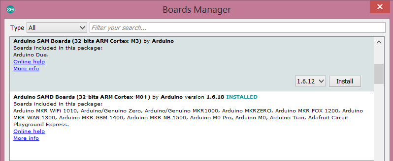

Porting iotivity constrained to arduino 
----------------------------------------

The port target the arduino AVR(Mega2560)and ARM architectures, mostly arduino SAMD(arduino MKRZERO, though andy SAMD board should work) as well as the arduino Due. The build will use up all availlable memory on most arduino board except the Due(use this for more stable deployment of secuirty feature) on the device when executed statically thus depleting it before any stack allocation can start. the project thus deals only with dynamic allocation. The ipadapter for network requirement is based around the Wiznet w5500 shield,  dependant arduino C++ libraries were adapted by providing C wrappers. an SD card is used to provide pesistant storage for security build.this is made available via the C adapter libarduino-sdfat

Preparing Arduino Cores and Tools 
----------------------------------
I updated socket.cpp based on the mainline iotivity_1_2(arduino adapter) comment regarding the  fix required on the socket.cpp code for the udp receive method the patch is arduino_socket.patch. apply this patch to your socket.cpp file.

The iotivity constrained logging system is not directly compatible with arduino at it is. More, it need to handle different architecture. a library is provided for this as libarduino-serial. still one need to patch the oc_log.h to declare the the different logging methods. 

The arduino Time library target C++ code, though adding attribute like extern C or _cplusplus the however, it uses method overloading that is not acceptable from C perspective. i provide a basic tweak to make it usable. one can write a C++ class around it a provide a cleaner C wrapper or  just make it plain C. 

### Build tools

- **Arduino Makefile** [Arduino mk](https://github.com/sudar/Arduino-Makefile) Used to compile and upload the hex file to the arduino board. this is added as a submodule to this repository, thus it will fetch automatically.

- **Arduino sdk** [Arduino home](https://github.com/arduino/ArduinoCore-avr.git) , one can just provide a path to the local arduino IDE
   
- **Arduino libraries**

   - **Time library** [Time](https://github.com/PaulStoffregen/Time) for implementing (oc_clock.c method)

   - **Ethernet2 library** [w5500 ethernet](https://github.com/adafruit/Ethernet2) for implementing (ipadapter.c methods)

   - **pseudo random number generator**[pRNG](https://github.com/leomil72/pRNG) for implementing (oc_random.c method)

   - **Arduino FAT16/FAT32 Library**[SdFat](https://github.com/greiman/SdFat.git) for implementing (oc_storage.c method)

**Note:** For the ARM ARCH, the Due , we make use on the internal random module(TRNG), although for the SAMD, one can provide n efficient PRNG for those, at the moment we making use of the  utility from the SAMD core stdlib.

**Note:** Arduino sdk depends on the building platform thus one will need to define the path to arduino-home(arduino core, libraries... path) in the setup.mk manually. For ARM board(SAM/SAMD), intall toolchain and cores via the Arduino IDE(see below):

### Arduino SAM/SAMD tools and cores

   
Build process: linux 
---------------------
#### Get the development sources

`git clone --recurse-submodules https://github.com/yannS2016/iotivity-constrained-arduino`

#### Applying patch

all patch files are under iotivity-constrained-arduino/patches
```
 cd iotivity-constrained-arduino/adapter/iotivity-constrained 
 patch -p0 < ../../patches/iotivity_constrained.patch
 cd $ARDUINO_DIR
 patch -p0 < ~/iotivity-constrained-arduino/patches/arduino_socket.patch
 patch -p0 < ~/iotivity-constrained-arduino/patches/arduino_time.patch
```
 
**Note:** The port was initially tested on commit(0840e0a41a95fcff725e498fc7245a828a1a65a3) based on this work [esp32 iotivity](https://github.com/espressif/esp32-iotivity).

cd ../../

### Unsecure build
```
#### For AVR target
make ARCH=avr SERVER=1 IPV4=1 DYNAMIC=1 XMEM=1 upload
#### Using an External SRAM: 
Consult the avr.mk to select the memory configuration that suite your needs
make SERVER=1 IPV4=1  DYNAMIC=1 XMEM=1 upload
```
```
#### For ARM(SAM or DUE) target
make ARCH=sam SERVER=1 IPV4=1 DYNAMIC=1 XMEM=1 upload
```
```
#### For ARM(SAMD) target
make ARCH=samd SERVER=1 IPV4=1 DYNAMIC=1 XMEM=1 upload
```
### Secure build
```
#### For AVR target
make ARCH=avr SERVER=1 IPV4=1 DYNAMIC=1 XMEM=1 SECURE=1 upload
#### Using an External SRAM: 
Consult the setup.mk to select the memory configuration that suite your needs
make ARCH=avr SERVER=1 IPV4=1  DYNAMIC=1 XMEM=1 SECURE=1 upload
```
```
#### For ARM(SAM/DUE) target
make ARCH=sam SERVER=1 IPV4=1 DYNAMIC=1 XMEM=1 SECURE=1 upload
```
```
#### For ARM(SAMD) target
make ARCH=samd SERVER=1 IPV4=1 DYNAMIC=1 XMEM=1 SECURE=1 upload 
```
Security
--------
Security Support as been added for all board. successful test were performed on ARM based devices, with better result obtain on the Arduino Due. However, for the mega, one need to adapt the stack to the external stack for a succesfful onboarding process and secuirted CRUDN. 

**Note:**: on SAMD board make sure to disable DEBUG as much as possible.

Testing
-------
Under test  see some log of what to expect from the arduino server when running the simpleclient app from linux. An arduino client test is also provided under this path for operating as a resources requester. Additional tests show that one iotivity-constrained client/server can communicate with another client/server based on the main iotivity-code.some test were perfomed using the  iotivity node JS port(iotivity-node) as well yieldng expected results, i was even able to get good response from the iot-rest-api server. more on that will be documented. 

Using an extrnal memory for ( Mega) would become a requirment as the iotivity stack keep growing with additional feature. still it improve the performance of the board(Mega) and enable testing with Debug fully on, allocated larger space for internal structure. first test were done successfully pushing all heap allocation to external memory. For security feature one may need to push .data section as well heap to the xmem interface. 

Issues
------
Arduino does not handle IPV6, thus client wont be able to send unicast requests/responses automatically. from what i got, the client actually sent two request, one over IPV6(default) and another via IPV4 to the server which  receive both and reject the latter, although the response from the server contains all endpoints enabled(IPV6 and IPV4). By default the iotivity client code uses the first endpoint which is the IPV6 one. thus making arduino client unicast response unreachable(w5500 does not support IPV6). one should use the next endpoint from the reply(which IPV4) as `light_server = endpoint->next;`

mbeDTLS Memory constaints
--------------------------
```
AVR Memory Usage
----------------
Device: atmega2560
Program:  249194 bytes (95.1% Full)
(.text + .data + .bootloader)
Data:      19452 bytes (237.5% Full)
(.data + .bss + .noinit)

```
```
arm-none-eabi-size -B build-arduino_due_x/iotivity-constrained-arduino.elf
   text    data     bss     dec     hex filename
 186436       0    4912  191348   2eb74 build-arduino_due_x/iotivity-constrained-arduino.elf
```
```
arm-none-eabi-size -B build-arduino_due_x/iotivity-constrained-arduino.elf
   text    data     bss     dec     hex filename
 167596    3744    4448  175788   2aeac build-mkrzero/iotivity-constrained-arduino.elf
```
